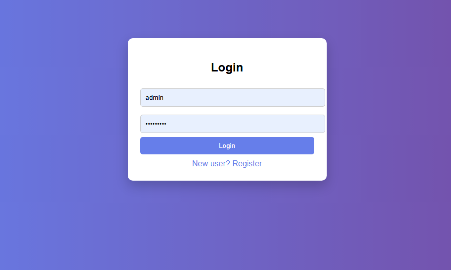
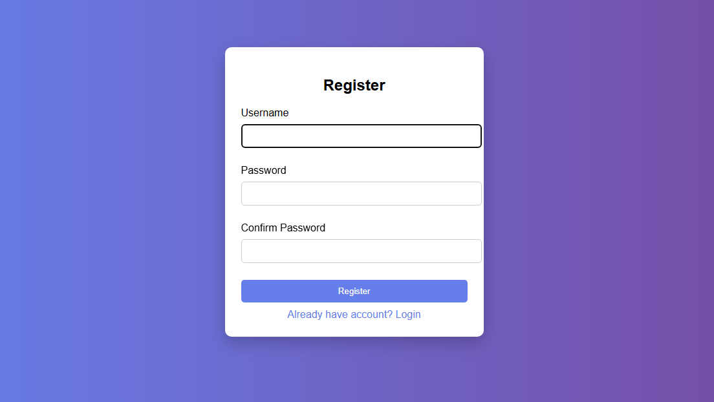
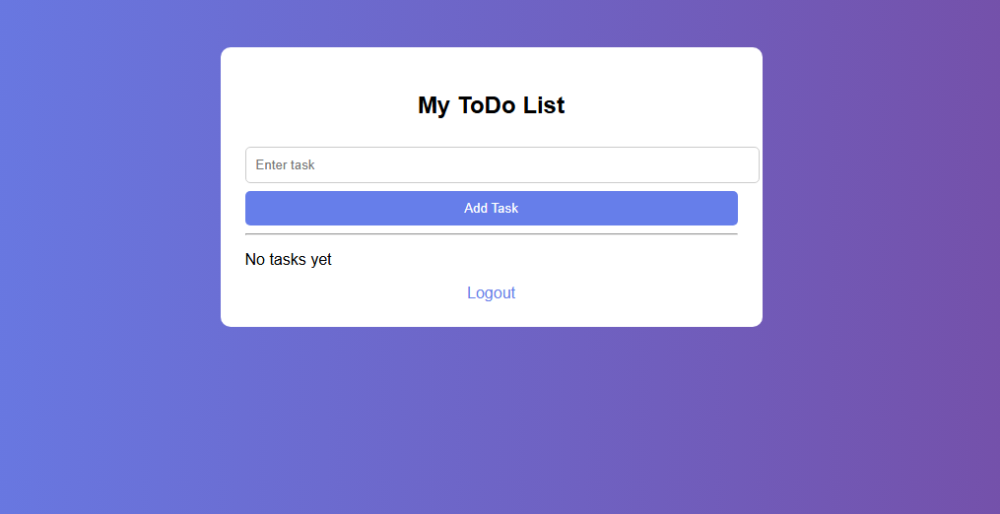
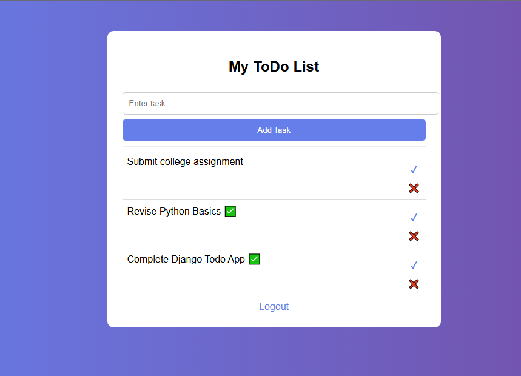
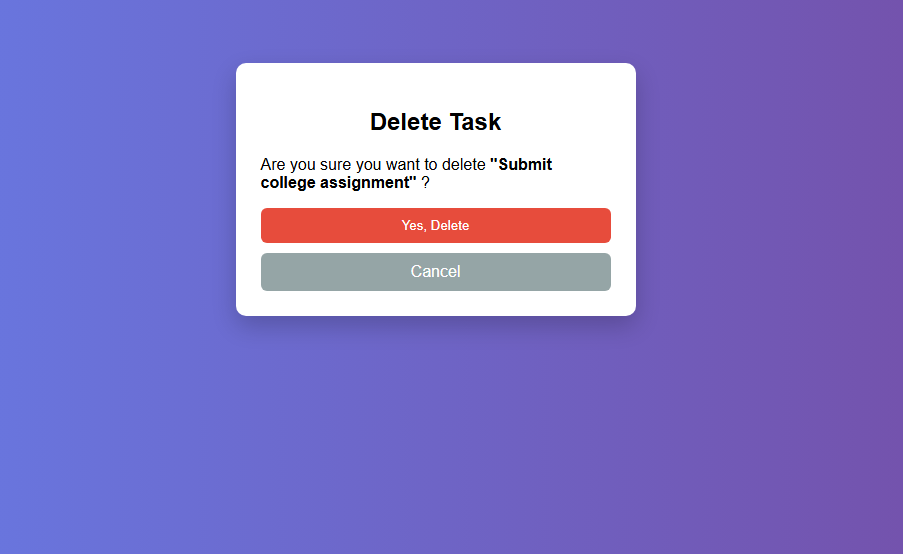

✅ Django Todo App 📝

A simple, clean, and modern Todo Web Application built using Django.
This app helps users manage daily tasks efficiently with authentication support.

---

✨ Features

🔐 User Authentication

Register new users

Login & Logout functionality

🗂️ Task Management

Add new tasks

Mark tasks as completed

Delete tasks with confirmation

🎨 User Interface

Responsive card-based layout

Modern buttons & hover effects

Clean and simple UI

🧾 Forms

Customized Django UserCreationForm

Removed default password help text for better UX

---

🛠️ Technologies Used

🐍 Python 3.x

🌐 Django 6.x

🎨 HTML5 / CSS3

🗄️ SQLite (default Django database)

🔧 Git & GitHub

---

📸 Screenshots

🔐 Login Page

📝 Register Page

🏠 Home / Todo List

➕ Add Task Page

❌ Delete Task Page

---

📂 Project Structure

ToDoProject/
│── todoapp/
│   ├── static/
│   │   └── css/
│   ├── templates/
│   │   ├── home.html
│   │   ├── login.html
│   │   ├── register.html
│   │   └── delete.html
│── ToDoProject/
│── screenshots/
│   ├── login.png
│   ├── register.png
│   ├── home.png
│   ├── add_task.png
│   └── delete.png
│── README.md
│── requirements.txt
│── manage.py
│── .gitignore

---

⚙️ Installation & Setup

1️⃣ Clone the Repository

git clone https://github.com/kamble-shreya-pydev/django-todo-app.git
cd todoproject

2️⃣ Create a Virtual Environment

python -m venv myenv

3️⃣ Activate Virtual Environment

Windows

myenv\Scripts\activate

4️⃣ Install Dependencies

pip install -r requirements.txt

5️⃣ Apply Migrations

python manage.py makemigrations
python manage.py migrate

6️⃣ Run the Server

python manage.py runserver

7️⃣ Open in Browser 🌍

http://127.0.0.1:8000/

---

🚀 Future Enhancements

✨ User-specific tasks (each user sees only their own tasks)
📅 Add task due dates
🌙 Dark mode / Theme switcher
☁️ Deploy to cloud (Heroku / Render / AWS)

---

🤝 Contributing

Contributions are welcome! Feel free to fork this repository and submit a pull request.

---

📜 License

This project is open-source and available under the MIT License.

---

💙 If you like this project, don’t forget to give it a ⭐ on GitHub!